# Постановка задачи

 Введем следующую задачу:
 
 Допустим у нас имеется удаленный репозиторий с workflow и файлами, необходимыми для его работы, как например проект тестов и workflow для тестирования. Нам необходимо протестировать работу этого workflow и работу тестов так, чтобы оставить удаленный репозиторий без изменений и получить локальный результат тестирования.
 
# Описание программы

 Решение задачи будет основано на .NET Core, поддерживается тестирование программ на C#. Полное описание можно найти в отчете, расположенном в репозитории.
 
# Инструкция

### Настройка
 
   - Добавление PAT(при тестировании использовался PAT, дающий полный доступ ко всем функциям GH, но PAT с доступом к репозиторию и workflow достаточно) в качестве секрета в репозиторий (по умолчанию в workflow будет использоваться секрет с названием "TOKEN"). Добавить секрет можно в соответствующей вкладке в настройках репозитория;

   - Для поддержки работы тестов C# необходимо добавить в их .csproj код, приведенный далее, или код из файла ForTestCsproj.txt:
   ```
  <PropertyGroup>
    <GenerateAssemblyInfo>false</GenerateAssemblyInfo>
    <GenerateTargetFrameworkAttribute>false</GenerateTargetFrameworkAttribute>
    <GenerateProgramFile>false</GenerateProgramFile>
  </PropertyGroup>
  ```
   - Внести изменения в workflow:

   OnCreate:
   ```
   - uses: actions/checkout@v2
        with:
          ref: temp //указать имя временной ветви для тестирования

      - name: Copycat1
        uses: andstor/copycat-action@v3
        with:
          personal_token: ${{ secrets.TOKEN }}
          src_path: /.github/workflows/DeleteBranch.yml
          dst_path: /.github/workflows/.
          dst_owner: IlMkn  //автор репозитория
          dst_repo_name: GitHubActionsTest-2  //имя репозитоиря
          dst_branch: main
          src_branch: temp //указать имя временной ветви для тестирования
   ```
   OnCreateDispatch:
   ```
   - uses: actions/checkout@v2
      with:
        ref: temp  //указать имя временной ветви для тестирования
   
     uses: andstor/copycat-action@v3
      with:
        personal_token: ${{ secrets.TOKEN }}
        src_path: /CSTests/. //путь к тестам
        dst_path: /. //путь для копирования
        dst_owner: IlMkn //автор репозитория
        dst_repo_name: GitHubActionsTest-2 //имя репозитоиря
        dst_branch: temp //ветвь, в которую будет произведено копирование
        src_branch: main //ветвь, из которой будет происходить копирование
   ```
   DeleteBranches:
   ```
    uses: dawidd6/action-delete-branch@v3
      with:
        github_token: ${{github.token}}
        branches: temp //название ветви, которая будет удалена
   ```
   BuildAndTest: 
   ```
   - name: Add csproj
        continue-on-error: true
        id: step2
        if: steps.check_files1.outputs.files_exists == 'true'
        run: |
          dotnet sln ./myNewFolder/t.sln add **/TestConsoleApp.csproj //указать .csproj проекта, который нужно протестировать
          dotnet add XUnitTestProject1.csproj reference **/TestConsoleApp.csproj //указать .csproj проекта с тестами
          dotnet sln ./myNewFolder/t.sln add XUnitTestProject1.csproj //указать .csproj проекта с тестами
          nuget restore ./myNewFolder/t.sln
                  
      - name: Build
        continue-on-error: true
        id: step3
        if: steps.check_files1.outputs.files_exists == 'true'
        run: |
          dotnet build ./myNewFolder/t.sln
      - name: Test
        continue-on-error: true
        id: step4
        if: steps.check_files1.outputs.files_exists == 'true'
        run: |
          dotnet test XUnitTestProject1.csproj --logger "trx;LogFileName=test-results.trx" //указать .csproj проекта с тестами   
   ```
   - Следует отметить, что workflow, который мы будем тестировать, не должен содержать id для своих шагов, а сами шаги не должны иметь модификатор "continue-on-error: true";<br />
   - При создании локальной копии папки с примером кода для тестирования нужно поменять в ней название папки "_github" на ".github". <br />
    
 ### Использование программы
 
   - Заполнить все необходимые для работы программы данные в файле конфигурации(jsonConfig.json):
    
   ```
   "PersonalAccessToken": "PAT", //Personal Access Token с доступом к репозиторию и workflow(параметры доступа задаются при создании PAT)
   "User": "IlMkn", //имя пользователя, в репозитории которого будет происходить тестирование
   "Repo": "IlMkn/GitHubActionsTest-2", //идентификатор репозитория, в котором будет происходить тестирование
   "SourceDir": "sourceDirCS", //название папки с кодом для тестирования(должна быть расположена в общей папке проекта вместе с его файлом .sln)
   "targetDir": "testDirectory2/targetDir", //название папки, в которую юудет происходить копирование кода для тестирования(можно оставить значение по умолчанию)
   "deleteDir": "testDirectory2" //удаляет папку с копией кода для тестирования после пуша содержимого в удаленый репозиторий
   ```
   - Необходимо указать имя файла с workflow, тестирование которого будет осуществляться;<br />
   - После старта программа создает локальную копию узаканного workflow и дополняет его таким образом, чтобы этот workflow мог передавать данные;<br />
   - По завершении дополнения файл копируется в папке с кодом для тестирования и необходимыми для его осуществления workflow;<br />
   - После успешного пуша и создания ветки "temp" программа ожидает завершения workflow и загрузки артефактов в репозиторий(в текущей реализации просто используется Thread.Sleep()). В некоторых ситуациях, когда сервера GitHub могут быть сильно нагружены, времени установленного для простоя по умолчанию может не хватить. В этом случае стоит изменить параметр в Thread.Sleep();<br />
   - После завершения работы программы в консоль будет осуществлен базовый вывод информации о ходе тестирования. Ту же информацию можно найти в локальной папке дебага программы (conc.txt\conclusion.txt). <br />
# Пример работы

В качестве кода для тестирования возьмем содержимое папки sourceDirCS, копируя её в локальную директорию, содержащую саму программу, осуществляющую тестирование. 
Добавив свой PAT и следующие данные в jsonConfig.json:

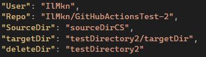

Запустив программу мы имитируем работу клиента git, создаем ветку temp в удаленном репозитории и добавляем в неё файлы из sourceDirCS:

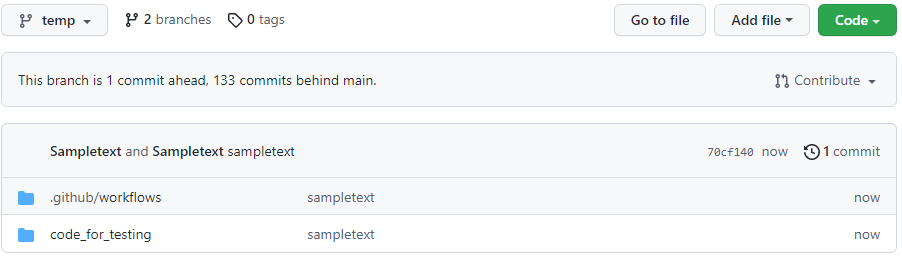

При создании ветки начинается workflow "OnCreate", предназначение которого - запустить в работу workflow, описанные в main ветке репозитория.


Первым после "OnCreate" запускается workflow "CopyFolder", который копирует в temp ветку файлы тестов. В нашем случае это тест DotNet. 

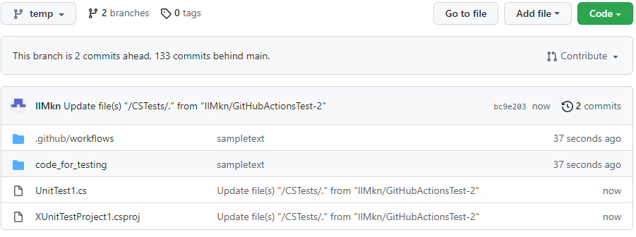

После завершения "CopyFolder" запускается workflow "BuildAndTest", который, что следует из названия, строит проект и запускает тесты для него. Помимо этого в "BuildAndTest" проводится проверка работы индивидуальных шагов workflow, таких как "Create sln", "Add csproj". В нем же создаётся артефакт, который описывает статус выполнения workflow:

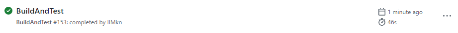

После "BuildAndTest" запускается "DeleteBranch", который удаляет ветку temp:

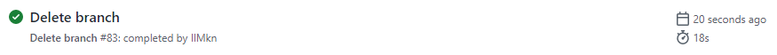

После этого в репозитории остается только ветка main:

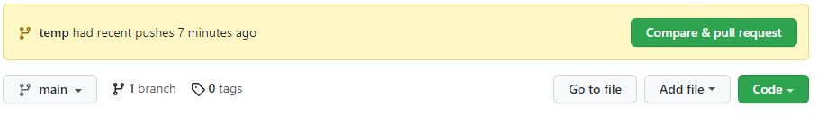

После "CopyFolder" и "BuildAndTest" запускаются "CheckCopyFolder" и "CheckBuildAndTest" соответственно. Они нужны для получения данных посредством артефактов о завершении работы соответствующих workflow:

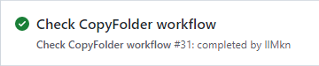

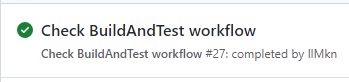

После окончания задержки в программе осуществляется скачивание артефакта, в котором содержится информация о статусе завершения "CopyFolder". В случае, если этот workflow завершился успешно, осуществляется скачивание оставшихся артефактов, содержащих информацию о результате тестирования и удаления ветви.

Последовательность запусков workflow выглядит следующим образом:

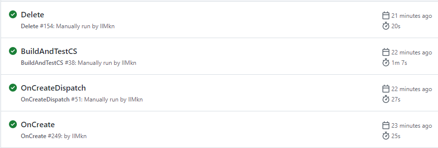

В результате у нас остается только ветка main:


После получения всех артефактов программа выводит результат их обрботки. В нашем случае все проверки пройдены и мы получаем следующий вывод:

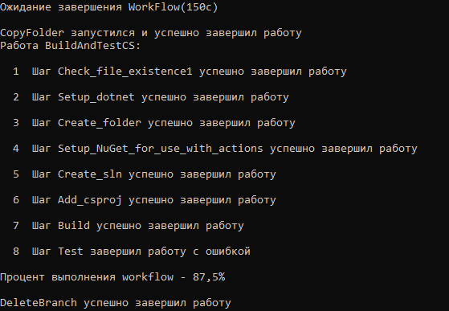

В локальной папке дебага можно также найти сам артефакт(conclusion.txt), в котором также будет вывод из workflow:

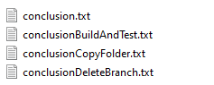

## Использованные API
Checkout - https://github.com/actions/checkout;<br />
File Existence - https://github.com/andstor/file-existence-action;<br />
Copy File - https://github.com/andstor/copycat-action;<br />
Delete Branch - https://github.com/dawidd6/action-delete-branch;<br />
Setup DotNet - https://github.com/actions/setup-dotnet;<br />
Setup NuGet - https://github.com/NuGet/setup-nuget;<br />
Upload Artifact - https://github.com/actions/upload-artifact;<br />
Write File - https://github.com/DamianReeves/write-file-action;<br />
Git functions - https://github.com/libgit2/libgit2sharp;<br />
JSON library - https://github.com/JamesNK/Newtonsoft.Json.
